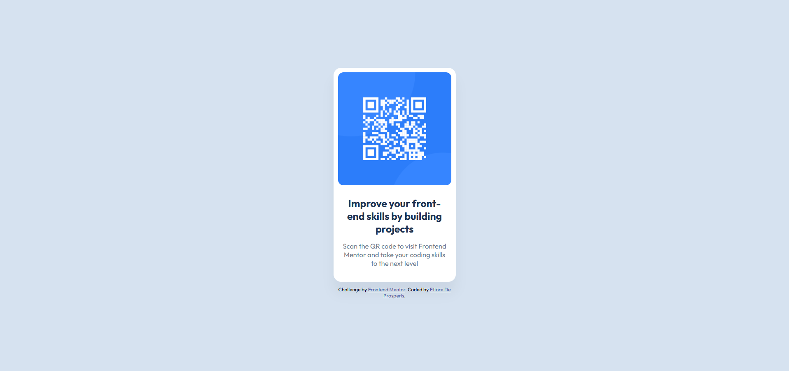

# Frontend Mentor - QR code component solution

This is a solution to the [QR code component challenge on Frontend Mentor](https://www.frontendmentor.io/challenges/qr-code-component-iux_sIO_H). Frontend Mentor challenges help you improve your coding skills by building realistic projects. 

## Table of contents

- [Overview](#overview)
  - [Screenshot](#screenshot)
  - [Links](#links)
- [My process](#my-process)
  - [Built with](#built-with)
  - [What I learned](#what-i-learned)
  - [AI Collaboration](#ai-collaboration)

## Overview

### Screenshot

### Links

- Solution URL: [https://github.com/eTToReeDP/qr-code-component-main](https://github.com/eTToReeDP/qr-code-component-main)
- Live Site URL: [https://ettoreedp.github.io/qr-code-component-main/](https://ettoreedp.github.io/qr-code-component-main/)

## My process

### Built with

- Semantic HTML5 markup
- CSS3
- Flexbox
- Google Fonts (Outfit)

### What I learned

In this project, I learned how to effectively center a component using Flexbox. I understood the importance of `min-height: 100vh` to ensure the component stays centered vertically on the full screen.

I also learned how to create a smooth, professional-looking shadow using `rgba` for transparency, rather than a solid color.

Finally, I reinforced the importance of adding units (like `px`) to CSS properties, as forgetting them (e.g., writing `padding: 10` instead of `padding: 10px`) causes the browser to ignore the style.

### AI Collaboration

I used **Google Gemini** as a virtual mentor and pair programmer during this project.

- **Tools used:** Google Gemini.
- **How I used it:**
  - **Debugging:** I used AI to help identify why my fonts weren't rendering correctly and to catch syntax errors (like missing units in CSS).
  - **Visual Refinement:** I asked for feedback on how close my design was to the original image and received specific advice on box-shadows and spacing.
  - **Workflow:** I used it to learn how to deploy my project to GitHub Pages and how to structure this README file properly.
- **What worked well:** The AI was excellent at explaining *why* a specific piece of code wasn't working (e.g., the importance of `px` units), which helped me learn rather than just fix the bug. It also provided great values for the soft drop shadow which is hard to guess manually.